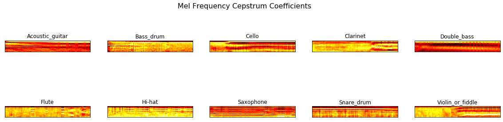

# Audio Classifier

### Overview:
A supervised classifier used to determine one of ten instruments given to it. The [full procedure](https://github.com/theadamsabra/Audio-Classifier/blob/master/Full%20Procedure.ipynb) can be read if interested. The classification methods compared in this data were Support Vector Classifier (SVC) and Gaussian Naive Bayes Classifier as they generalize well for high-featured data. The SVC outperformed the Gaussian Naive Bayes significantly and had a test accuracy of **98%**.
